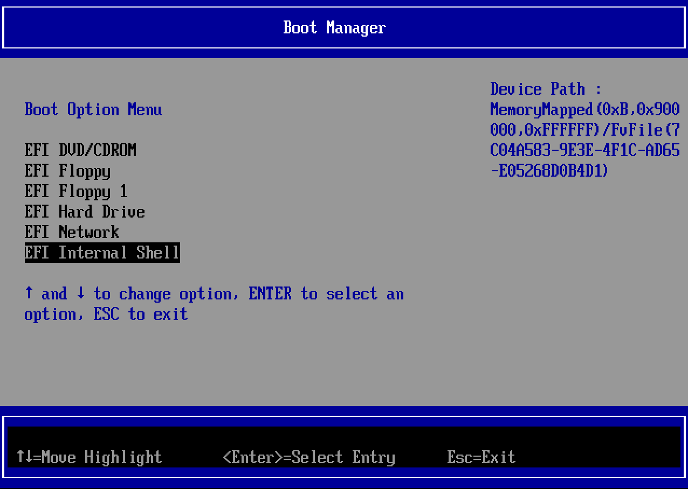

[Home](/)

# UEFI Shell快速入门
UEFI小白15分钟上手
<!-- TOC -->

- [1. 启动UEFI](#1-启动uefi)
    - [1.1. 用QEMU启动UEFI Shell](#11-用qemu启动uefi-shell)
    - [1.2. VirtualBox上启动UEFI](#12-virtualbox上启动uefi)
    - [1.3. VMWare(Workstation或Fusion)上启动UEFI](#13-vmwareworkstation或fusion上启动uefi)
    - [1.4. 物理机上启动UEFI Shell](#14-物理机上启动uefi-shell)
- [2. 熟悉UEFI Shell](#2-熟悉uefi-shell)
    - [2.1. 初次尝试](#21-初次尝试)
    - [2.2. 更多命令](#22-更多命令)

<!-- /TOC -->

## 1. 启动UEFI

### 1.1. 用QEMU启动UEFI Shell
下载UEFI:
```bash
curl -O https://superb-sea2.dl.sourceforge.net/project/edk2/OVMF/OVMF-X64-r15214.zip
unzip OVMF-X64-r15214.zip
```

运行Qemu，建议在启动时按下ESC:
```
qemu-system-x86_64 --bios OVMF.fd -net none
```

然后选择"Boot Manager" -> "EFI Internal Shell":


### 1.2. VirtualBox上启动UEFI
1. 创建一虚拟机，OS类型任意
1. Setting -> System -> Enable EFI
1. 启动进入EFI

### 1.3. VMWare(Workstation或Fusion)上启动UEFI
1. 创建一虚拟机，OS类型任意。注意创建完后不要立即启动系统。
1. Setting -> Option -> Advanced -> EFI (注)
1. Virtual Machine菜单 -> Power on to firmware，然后在EFI/BIOS界面选择EFI Shell

注：若是VMWare Fusion, 第二步需要手动修改.vmx文件，在文件末尾添加下面一行：
```
firmware = "efi"
```

### 1.4. 物理机上启动UEFI Shell
不同的物理机操作方式可能不同：如果主板自带EFI Shell，则物理机上的操作与QEMU类似；否则需要自行添加外部Shell，可以通过将EFI shell伪装成bootloader的方式来实现——

1. [点击这里下载](https://raw.githubusercontent.com/tianocore/edk2/master/ShellBinPkg/UefiShell/X64/Shell.efi)EFI Shell
2. 插入U盘，格式化为FAT32，创建efi/boot目录，把Shell.efi复制到efi/boot/bootx64.efi
3. 重启系统，选择从该U盘启动，你就会看到EFI Shell界面了。

## 2. 熟悉UEFI Shell

### 2.1. 初次尝试
```bash
map # 查看块设备
pci # 查看PCI设备
reset
```

### 2.2. 更多命令
google for more UEFI shell commands，也可参考[这篇文章](https://docstore.mik.ua/manuals/hp-ux/en/5991-1247B/ch04s13.html)

<!--
(见See also)

See also
- https://wiki.archlinux.org/index.php/Unified_Extensible_Firmware_Interface
- ftp://ftp.maxdata.de/MAXDATA_PLATINUM_Server/Firmware_and_Bios/MPL_Server/EFI_Instructions.pdf
- https://docstore.mik.ua/manuals/hp-ux/en/5991-1247B/ch04s13.html
 -->

[Home](/)
