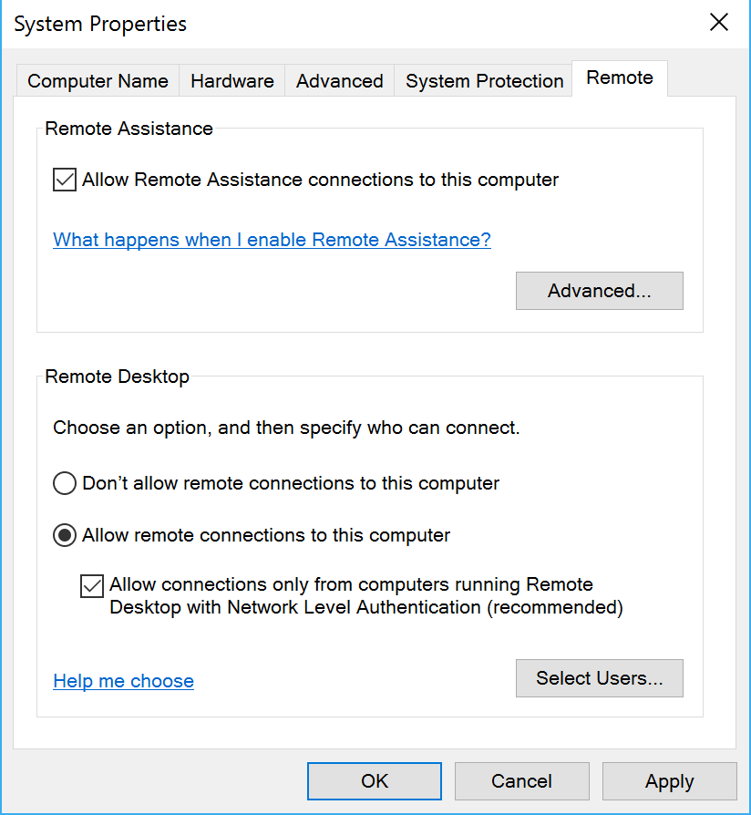
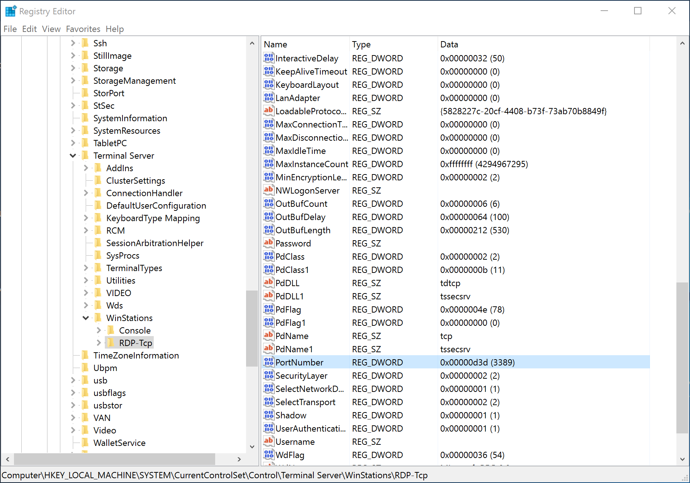

[Home](/)

# Networking


<!-- TOC -->

- [1. Remote Access](#1-remote-access)
    - [1.1. Overview](#11-overview)
    - [1.2. SSH](#12-ssh)
        - [1.2.1. Windows](#121-windows)
        - [1.2.2. Linux/FreeBSD](#122-linuxfreebsd)
        - [1.2.3. macOS](#123-macos)
        - [1.2.4. Client](#124-client)
    - [1.3. VNC](#13-vnc)
        - [1.3.1. Windows](#131-windows)
        - [1.3.2. Linux/FreeBSD](#132-linuxfreebsd)
        - [1.3.3. macOS](#133-macos)
        - [1.3.4. Client](#134-client)
    - [1.4. RDP](#14-rdp)
        - [1.4.1. Server (Windows only)](#141-server-windows-only)
        - [1.4.2. Client](#142-client)
    - [1.5. X11](#15-x11)
        - [1.5.1. Server (Unix-like only)](#151-server-unix-like-only)
        - [1.5.2. Client](#152-client)

<!-- /TOC -->

## 1. Remote Access

### 1.1. Overview

Protocol | Port | Host | Comments
---------|------|------|---------
SSH | 22 | All |
RDP | 3389 | Windows |
VNC | 5900 | All |
X11 | 6000 | Unix | ?

### 1.2. SSH

#### 1.2.1. Windows

#### 1.2.2. Linux/FreeBSD

#### 1.2.3. macOS

#### 1.2.4. Client

### 1.3. VNC

#### 1.3.1. Windows

#### 1.3.2. Linux/FreeBSD

#### 1.3.3. macOS

#### 1.3.4. Client

### 1.4. RDP

#### 1.4.1. Server (Windows only)

system > Advanced system settings



To change the default port:



#### 1.4.2. Client

windows: remote desktop connection

linux: vinagre

### 1.5. X11

#### 1.5.1. Server (Unix-like only)

#### 1.5.2. Client


## VPN
```bash
/usr/lib/networkmanager/nm-l2tp-service --debug
```

## modify the host name

_Windows_
```PowerShell
?
```

_Linux_
```bash
hostnamectl
```

_macOS_

```
scutil –-set HostName localhost
```

## network utilities

## 远程桌面

## SSH

## References
- https://en.wikipedia.org/wiki/Iproute2
